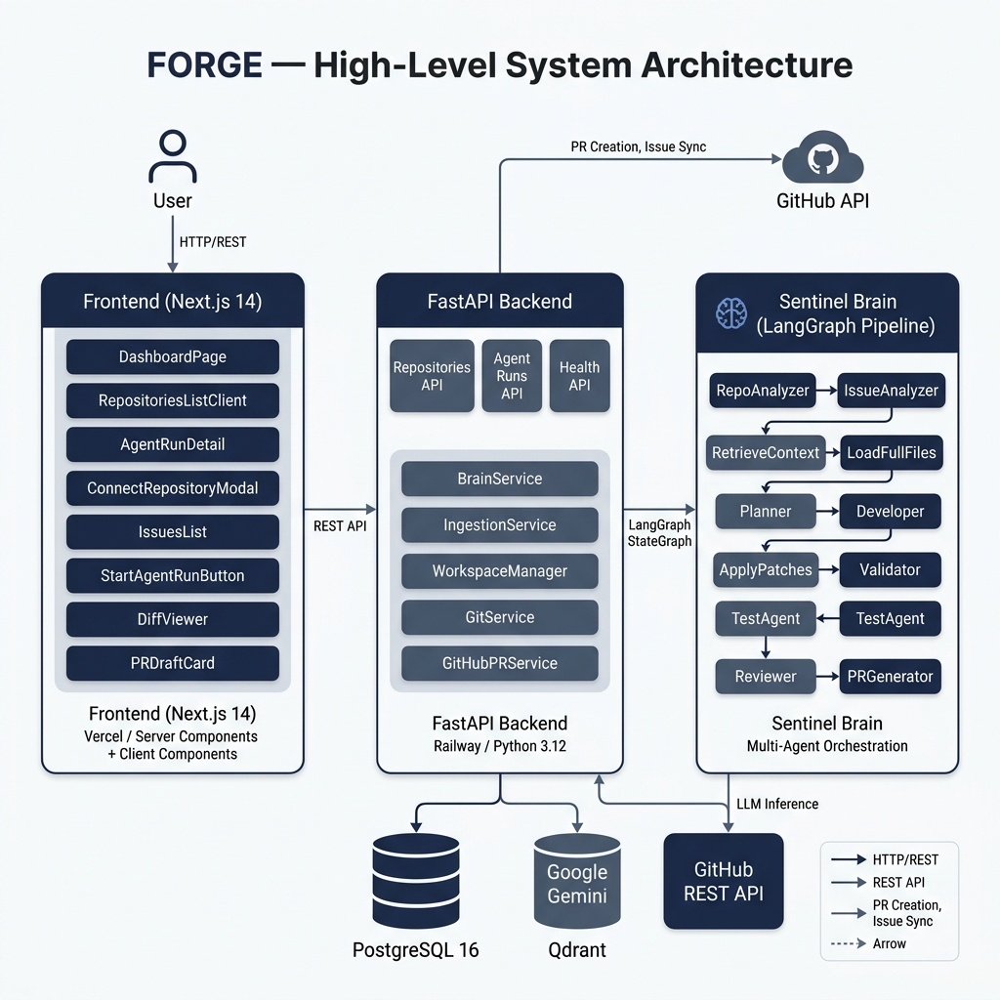
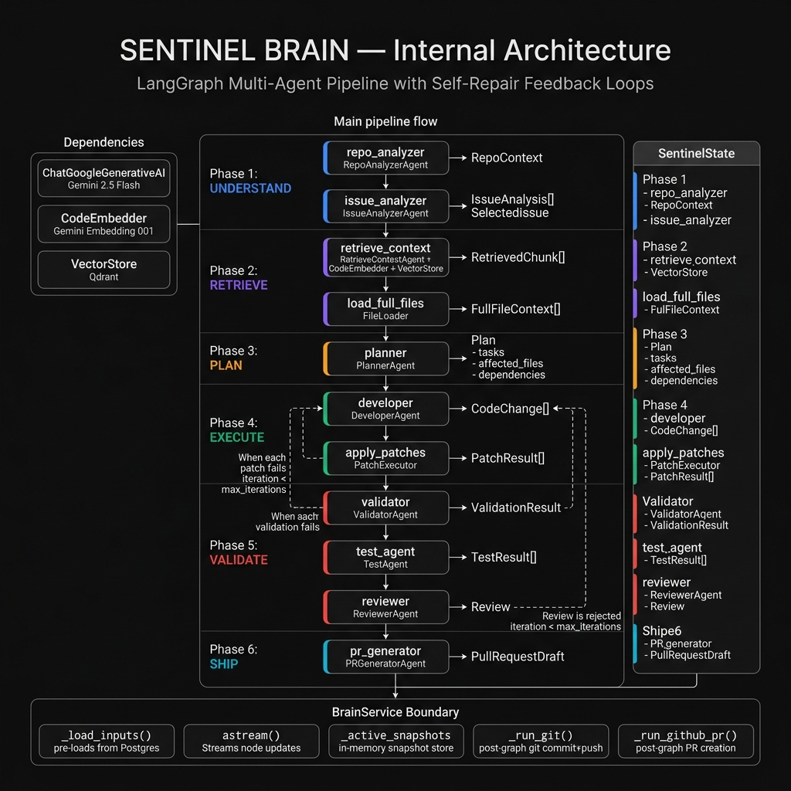
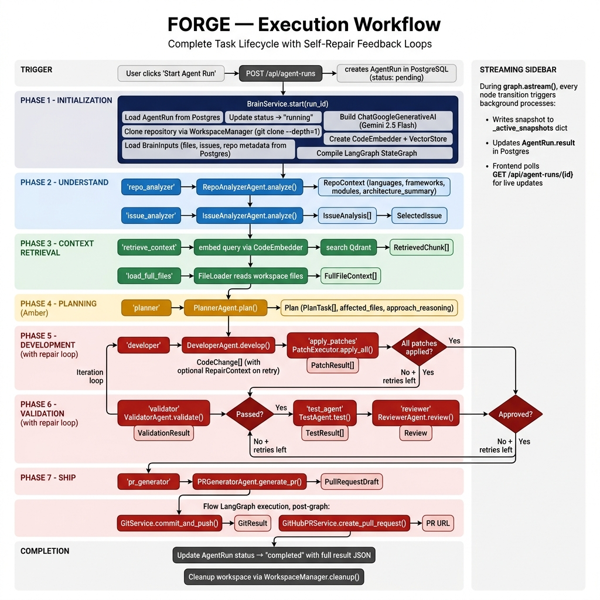
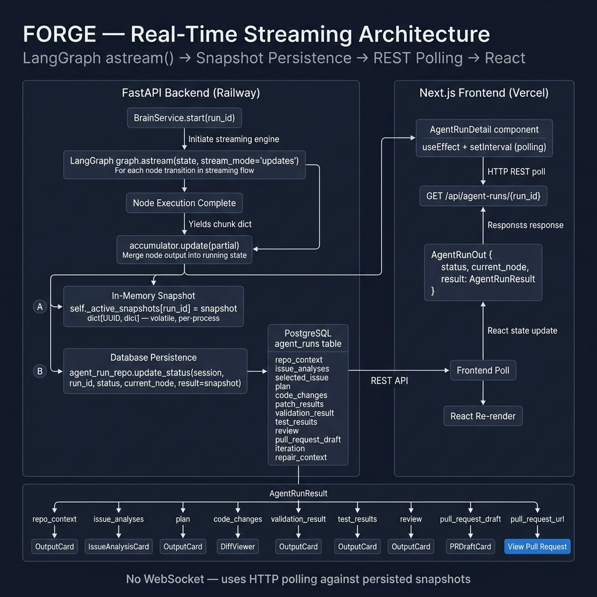
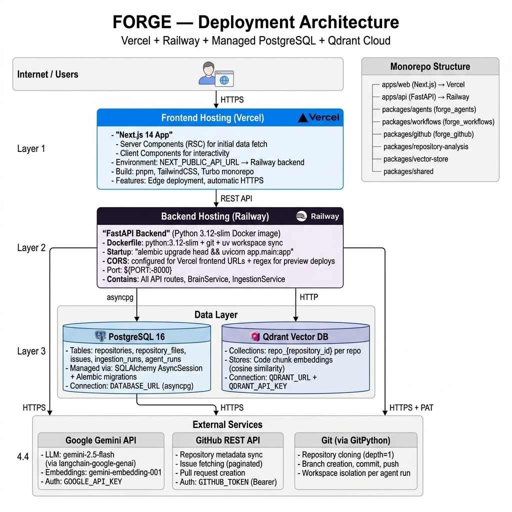
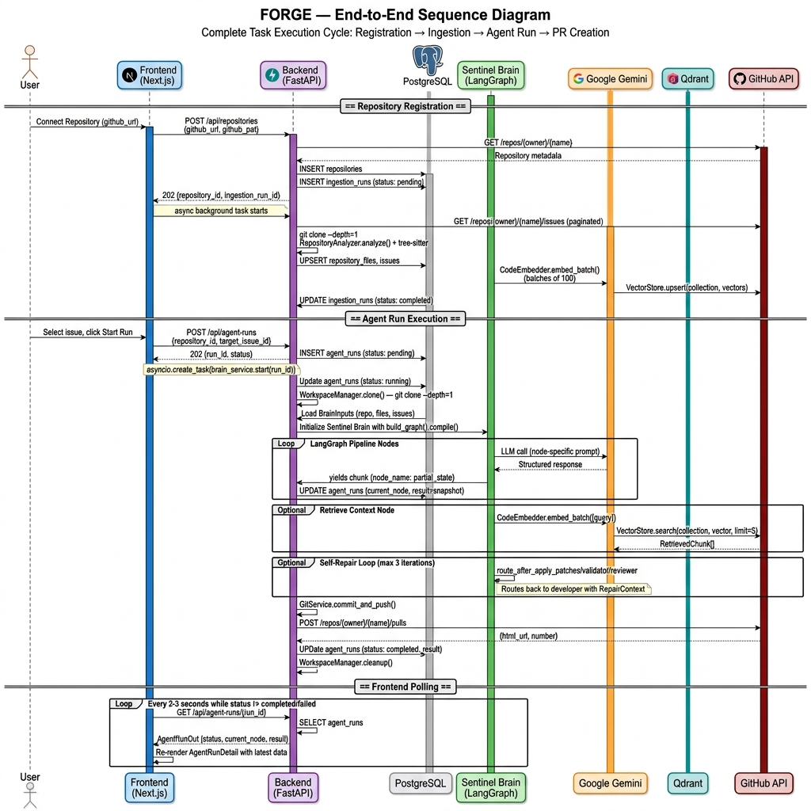

# Forge - Autonomous Software Engineer

> Built by a 2-member team during a hackathon to demonstrate autonomous software engineering through transparent AI agents that convert GitHub issues into reviewed Pull Requests.

Forge is an AI-powered autonomous software engineering platform that analyzes repositories, understands issues, plans implementations, generates code, validates changes, reviews modifications, and creates Pull Requests with complete transparency throughout the execution lifecycle.

---

## Live Demo

🌐 **Live Application**

https://web-delta-nine-79.vercel.app

🎥 **End-to-End Demo**

```text
demo/forge-demo.mp4
```

---

## Overview

Modern AI coding assistants can generate code, but developers still spend significant effort understanding repositories, planning implementations, validating changes, reviewing outputs, and managing pull requests.

Forge addresses this challenge by acting as an autonomous software engineer capable of handling the complete issue-to-pull-request workflow while keeping every decision visible and explainable.

The platform combines repository intelligence, retrieval-augmented context, multi-stage agent workflows, automated validation, and review mechanisms to create production-ready pull requests from GitHub issues.

---

## Problem Statement

Software development involves repetitive workflows:

* Understanding unfamiliar repositories
* Analyzing and prioritizing issues
* Planning implementation strategies
* Making code modifications
* Validating changes
* Reviewing generated code
* Creating pull requests

While AI assistants help generate code, they typically do not orchestrate the entire development lifecycle.

Forge was built to automate this process and provide an end-to-end autonomous software engineering experience.

---

## Solution

Forge transforms GitHub issues into reviewed pull requests through a structured execution pipeline.

### Workflow

```text
Repository Registration
          ↓
Repository Analysis
          ↓
Issue Selection
          ↓
Context Retrieval
          ↓
Planning
          ↓
Code Generation
          ↓
Patch Application
          ↓
Validation
          ↓
Testing
          ↓
Review
          ↓
Pull Request Generation
```

Every stage produces structured outputs that are visible to the user through the platform's interface.

---

## Key Features

### Autonomous Issue Resolution

Forge analyzes repository issues and autonomously generates implementation plans.

### Repository Intelligence

The system indexes repository structure, files, and issues to build contextual understanding before making modifications.

### Retrieval-Augmented Context

Relevant repository chunks are retrieved using semantic search, allowing agents to work with repository-specific context.

### Transparent Planning

Every execution begins with a detailed implementation plan including:

* Root cause analysis
* Proposed solution
* Affected files
* Expected impact

### Explainable Code Generation

All modifications are presented as structured diffs and patch operations.

### Automated Validation

Generated changes are validated before progressing through the workflow.

### AI-Powered Review

Dedicated review stages assess:

* Correctness
* Risk
* Impact
* Merge readiness

### Pull Request Generation

Forge automatically drafts pull requests containing:

* Change summaries
* Validation results
* Review outcomes
* Merge recommendations

### Complete Transparency

Every step of execution is observable through live status updates and detailed workflow outputs.

---

## Architecture

### High-Level System Architecture



### Sentinel Brain Architecture



### Execution Workflow



### Real-Time Streaming Architecture



### Retrieval & Context Architecture


### Deployment Architecture



### End-to-End Sequence Diagram



---

## Architecture Documentation

Detailed architectural analysis and implementation documentation are available in:

```text
architecture/README.md
```

The documentation covers:

* System architecture
* Sentinel Brain internals
* Execution pipeline
* Retrieval architecture
* Streaming model
* Deployment design
* Sequence flows
* Security considerations
* Scalability observations

---

## Platform Walkthrough

### Dashboard & Repository Management

Browse and manage connected repositories while monitoring indexing progress and issue availability.

### Repository Analysis

Forge analyzes repository structure, source files, repository metadata, and open GitHub issues.

### Agent Execution

Users can select an issue and launch an autonomous execution run.

The platform provides visibility into:

* Current execution stage
* Active reasoning process
* Generated outputs
* Progress updates

### Planning & Analysis

Forge generates a structured implementation plan before modifying code.

### Code Generation

Generated code modifications are displayed through transparent diffs.

### Review & Validation

Validation, testing, and review stages evaluate generated modifications before pull request creation.

### Pull Request Generation

Forge drafts GitHub pull requests containing implementation details, review results, and validation summaries.

---

## Technology Stack

### Frontend

* Next.js
* React
* TypeScript
* Tailwind CSS

### Backend

* Python
* FastAPI

### AI & Agent Framework

* LangGraph
* LangChain
* Google Gemini

### Repository Intelligence

* Tree-sitter
* Repository Analysis Pipeline

### Retrieval Layer

* Qdrant Vector Database
* Semantic Code Retrieval
* Embedding-Based Search

### Integrations

* GitHub REST API

### Infrastructure

* Docker
* PostgreSQL
* Railway
* Vercel

---

## My Contribution

I primarily focused on the design and architecture of Forge's autonomous execution system.

### Agent Workflow Design

Designed and refined the end-to-end issue-to-pull-request workflow.

### Multi-Agent Architecture

Contributed to:

* Agent responsibilities
* Execution stage design
* Workflow orchestration
* Agent coordination
* State transition modeling

### Planning & Review Pipeline

Worked on:

* Issue analysis flow
* Planning architecture
* Validation checkpoints
* Review pipeline structure
* Execution transparency mechanisms

### System Architecture

Created and refined:

* Workflow architecture
* Execution flow design
* Agent interaction models
* Architectural documentation
* Technical visualizations

### Showcase Repository

Built this showcase repository to document and demonstrate the architecture, workflow, and capabilities of Forge.

---

## Screenshots

The complete execution journey is documented through categorized screenshots:

```text
screenshots/
├── 01-overview
├── 02-repository-analysis
├── 03-agent-execution
├── 04-analysis-and-planning
├── 05-code-generation
├── 06-review-validation
├── 07-pull-request-generation
└── 08-history
```

---

## Repositories

### Main Development Repository

https://github.com/cyrotine/sentinel

### Showcase Repository

https://github.com/parthagrawalcodes/forge-project-showcase

---

## Team

Forge was built by a two-member team during a hackathon.

### Contributors

**Parth Agrawal**

* Agent workflow design
* Multi-agent architecture
* Planning and review workflows
* System architecture
* Technical documentation

**Cyrotine**

* Core platform implementation
* Frontend and backend development
* GitHub integration
* Deployment and infrastructure

---

## Future Improvements

* Multi-repository execution support
* Parallel issue resolution
* Advanced testing agents
* Security-focused review agents
* Long-term execution memory
* Team collaboration workflows
* Enterprise repository integrations

---

## License

This repository is intended for project showcase and portfolio purposes.

For source code, implementation details, and development history, please refer to the main development repository.
